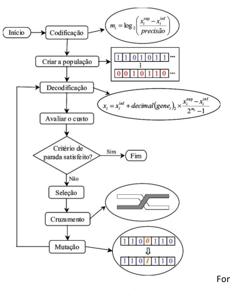

# Genetic Algorithms

## How to run the project:
1. Install numpy and matplotlib with - pip3 install numpy matplotlib
2. Run the "Program.py" file with - python3 Program.py
3. Choose the size of each population
4. Choose how many generations there will be
5. Wait for the genetic algorithm
6. Choose v to visualize the graphics
7. Choose a to see the animation of all generations and then choose how much time each frame will have
8. Choose m to see the best generation
## Código:
- Codificação
- Busca
- Fitness
 

1. Criar uma população aleatória, dentro do intervalo
   1. Calcular o fitness de cada população

## Codificação
- Real: elementos usam valores float

## Seleção
- Roleta (estocástica)
- Em teoria probabilística, o padrão estocástico é aquele cujo estado é indeterminado, com origem em eventos aleatórios.

## Cruzamento
- Aritmético
> ğ¹1 = 𛽠∗ ğ‘ƒ1 + 1 − 𛽠∗ ğ‘ƒ2  
> 𝐹2 = 𝛽 ∗ 𝑃2 + 1 − 𝛽 ∗ 𝑃1
- em que 𝛽 ∈ 𝑈[0,1]
- Taxa de Cruzamento
> Normalmente varia entre 60% (0,6) e 90% (0,9)

## Mutação 
- Mutação creep
consiste em acrescentar ou subtrair do gene selecionado
um valor aleatório obtido de uma distribuição 𝑁(0, 𝜎² )
considerando para 𝜎 2 um valor pequeno

## Elitismo
- 1 por população

## Tamanho da população
- 100